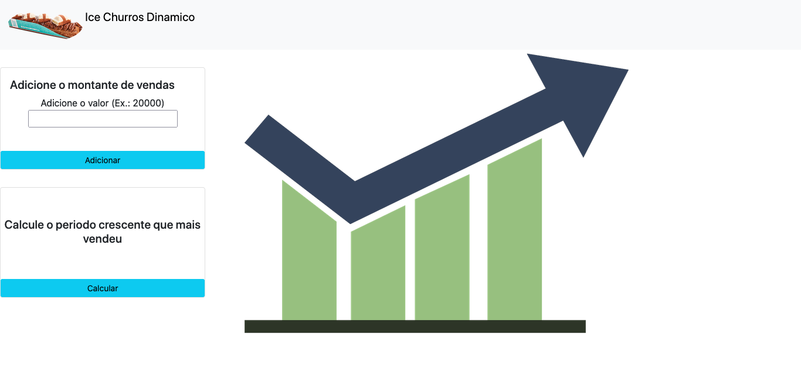
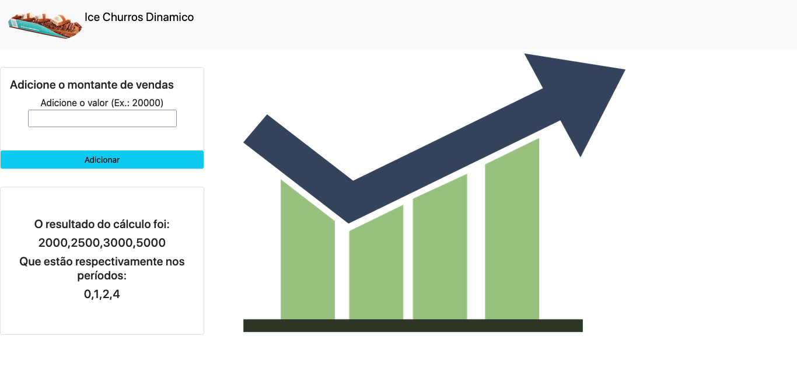

# Ice churros dinâmico

**Número da Lista**: 8 
**Conteúdo da Disciplina**: Programação dinâmica 

## Alunos
|Matrícula | Aluno |
| -- | -- |
| 19/0025298  | Bianca Sofia Brasil de Oliveira|
| 19/0026375  | Daniel Vinicius Ribeiro Alves |

## Sobre 
O objetivo do programa é encontrar o período em determinado intervalo de tempo que possuiu o periodo crescente que mais vendeu. Monstrando além do período a posição na lista de valores.

## Screenshot

## Instalação 
**Linguagem**: JavaScript 
Para rodar o projeto localmente, é necessário possuir o node instalado na máquina
Clone o repositório em sua máquina local, navegue até a pasta do JogoDuplaProxima e baixe as dependências com o comando npm install.
Para executar o projeto: node app.js. O projeto roda na porta: localhost:3000

## Uso 
Após executar o comando para rodar e abrir o localhost:3000, o usuário deve inserir os valores para serem adicionados na lista e em seguida clicar em calcular para mostrar o periodo e a posição na lista de valores.

